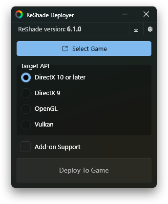

# ReShade Deployer
### A centralized alternative to the official ReShade installer



## Who is this for?
Those who want to:
- Keep a single shared Shaders folder for all their games instead of downloading new copies with every install.
- Update the .dll:s across all games to the latest version with a single click.
- Have your personal preconfigured ReShade.ini and ReShadePreset.ini files automatically installed.
- Quickly install ReShade from the (right-click) context menu on a game .exe or shortcut.

## Features
A minimal installer program that lets you:
- Pick graphics API (DirectX 10 or later, DirectX 9, OpenGL, Vulkan).
- Automatically pick between 64-bit and 32-bit by analysing the executable.
- Toggle a checkbox to install the 'Add-on Support' version.
- Add a 'Deploy ReShade' option to Window's context (right-click) menu for .exe files and shortcuts.
  - This will open the normal program window, but the 'Select Game' button is replaced by a 'Deploy to Game.exe' button so you don't need to navigate to the executable.
- Update all deployed ReShade .dll:s with a single click.
  - Possible because it creates symlinks instead of copying the .dll:s.

## Installation
1. Download the [latest release](https://github.com/Jobus0/ReShade-Deployer/releases/latest).
2. Extract **ReShade Deployer.exe** anywhere you want it.
   1. This is where you must keep your **Shaders** and **Textures** folders.
   2. If you already have a folder for **Shaders** and **Textures**, you can place **ReShade Deployer.exe** in the same folder.
3. Run the program and allow the first-time setup.
4. (Optional) Put any shader and texture files into the **Shaders** and **Textures** folders.
5. (Optional) Put a ReShade.ini and/or ReShadePreset.ini next to **ReShade Deployer.exe** to make the deployer automatically include those .ini:s when deploying to games.

The final folder structure looks like so:
```
ReShade
    lib
    Shaders
        *.fx/fxh
    Textures
        *.png
    ReShade Deployer.exe
    ReShade.ini (optional)
    ReShadePreset.ini (optional)
```
The **lib** folder contains the ReShade .dll:s, shader cache, and any saved deployer settings. It can be ignored.

## Usage
There are two ways to use ReShade Deployer: Running it normally, or running it from Windows's context menu.

### Normal
1. Run the program.
2. Select the target graphics API (DirectX, Vulkan, etc) that the game uses. If you are unsure, check the API section of the game's [PCGamingWiki](https://www.pcgamingwiki.com/wiki/Home) page.
3. Press the 'Select Game' button and navigate to the game's .exe.
4. If an existing ReShade preset is detected, it will ask whether to overwrite it.

### Context Menu
To enable this, run the program, and from the settings (cogwheel) list, check the **Context Menu Deploy** option.
1. Right-click any game .exe or shortcut in Windows's file explorer or desktop, and select 'Deploy ReShade'.
2. Select the target graphics API (DirectX, Vulkan, etc) that the game uses. If you are unsure, check the API section of the game's [PCGamingWiki](https://www.pcgamingwiki.com/wiki/Home) page.
3. Press the 'Deploy to Game' button.
4. If an existing ReShade preset is detected, it will ask whether to overwrite it.


## Contributing
Pull requests and request issues are welcome.

### Languages
Want to help translate ReShade Deployer into another language? ReShade Deployer uses the .NET XML resource (.resx) system for all UI text.

For example, to translate to French, just duplicate *UIStrings.resx* and name it *UIStrings.fr.resx* and start translating the values. The program language is automatically selected based on your OS's language.